# ComboBravo: Self-Learning Market Basket Intelligence System

## 1) Business Context + System Goal
**Chosen business context:** Food stall / kiosk combo recommender (Jollibee-like quick-service setup).

**Primary users:**
- Owner / manager: decides promo bundles, homepage priority, shelf placement.
- Cashier: gets real-time cross-sell prompts at checkout.
- Admin: uploads new transaction datasets and retrains the model.
- Customer: sees better "Frequently Bought Together" and combo suggestions.

**System goal:**
Build a self-learning backend that continuously ingests transactions, mines association patterns, scores recommendations, and updates business decisions across iterations.

## 2) What This System Builds (Project Objective Fit)
ComboBravo delivers an evolving MBA engine, not a one-time Apriori run:
- Ingests transactions (CSV upload or direct Supabase table import)
- Mines frequent patterns and association rules
- Scores and ranks rules for business usefulness
- Retrains automatically when new data is added
- Produces changing recommendations by iteration

## 3) Dataset A & B Description
Both base datasets are in `backend/data` and satisfy the class constraints.

| Dataset | Transactions | Unique Items | Segment Mix (Morning/Lunch/Dinner) | Use Case Flavor |
|---|---:|---:|---|---|
| Dataset A | 1,500 | 16 | 366 / 698 / 436 | Fast-moving staple combos |
| Dataset B | 1,500 | 17 | 401 / 653 / 446 | More diverse add-on behavior |

## 4) Additional Validation Datasets (C to F)
Added extra stress-test datasets:
- `backend/data/datasetC`
- `backend/data/datasetD`
- `backend/data/datasetE`
- `backend/data/datasetF`

Each has:
- 1,200 transactions
- 25 unique items
- `batch1`, `batch2`, `batch3`, and `margins.csv`

## 5) Pipeline Architecture Diagram

```mermaid
flowchart LR
    A[Supabase / CSV Source] --> B[Cleaning + Normalization]
    B --> C[Basket Encoding]
    C --> D[Frequent Pattern Mining\nFP-Growth or Apriori]
    D --> E[Association Rules\nSupport/Confidence/Lift/Leverage/Conviction]
    E --> F[Rule Scoring Model\nconf + lift + support + stability + profit]
    F --> G[Blending Engine\nLong-term + Recent]
    G --> H[Recommendations\nBundles / Cross-sell / Ranking / Promo]
    H --> I[Outputs + API + UI]

    I --> J[Iteration Metrics\ncoverage, hit-rate, drift, rule counts]
    J --> K[Self-Learning Loop]
    K --> D
```


## 6) Mining Algorithm Choice + Comparison to Apriori
### Chosen strategy
ComboBravo uses **adaptive FP-Growth / Apriori selection**, with FP-Growth favored for dense baskets.

### Why this fits better than Apriori-only
- **Apriori:** generates many candidate itemsets; slower as item count and basket density increase.
- **FP-Growth:** compresses transactions into an FP-tree; avoids candidate explosion.
- **Hybrid behavior in this project:** engine auto-selects based on data density and item count for better runtime stability.

## 7) Self-Learning Strategy
The self-learning behavior is real and iteration-driven:

### Trigger for updates
- New transactions appear (new upload or updated dataset in Supabase).
- Running `/api/run/{dataset}` or `/api/run-all` retrains from iteration 1 to 3.

### What changes over time
- Rule set composition (emerging/stable/fading patterns)
- Drift score (Jensen-Shannon distance)
- Blend weights (`w_long` vs `w_recent`)
- Rule ranking and recommendation coverage

### Intelligent mechanisms implemented
- Auto-tuned thresholds over support/confidence grids
- Drift-aware weighting between long-term and recent rule views
- Rule stability signal from previous iteration keys
- Multi-metric scoring (confidence + lift + support + stability + profit)
- Holdout hit-rate check

## 8) Results for Dataset A and Dataset B (Iteration 3)
Results taken from:
- `backend/outputs/datasetA/iteration_3_recs.json`
- `backend/outputs/datasetB/iteration_3_recs.json`

| Metric | Dataset A | Dataset B |
|---|---:|---:|
| Transactions used | 1,476 | 1,491 |
| Unique items | 16 | 17 |
| Coverage (top rules) | 0.2182 | 0.1502 |
| Estimated uplift score | 0.2909 | 0.2141 |
| Blended rule count | 3 | 2 |
| Holdout mean hit-rate (long) | 0.4545 | 0.3721 |
| Holdout mean hit-rate (recent) | 0.5000 | 0.0000 |

### Top bundle snapshot
- **Dataset A:** Nuggets + Sisig Rice + Iced Tea (lift ˜ 2.36)
- **Dataset B:** Cheese Stick + Iced Tea (lift ˜ 1.44)

### Top rule snapshot
- **Dataset A:** Nuggets + Sisig Rice -> Iced Tea (lift ˜ 2.36)
- **Dataset B:** Cheese Stick -> Iced Tea (lift ˜ 1.44)

## 9) Evaluation
ComboBravo evaluates recommendations using multiple angles:
- **Rule quality metrics:** support, confidence, lift, leverage, conviction
- **Model scoring:** weighted blend score for business prioritization
- **Holdout hit-rate:** checks how often top rules predict consequents
- **Portfolio movement:** stable / emerging / fading rule counts
- **Coverage metric:** % of baskets influenced by top rules

## 10) Limitations + Future Improvements
### Current limitations
- Heavy dependence on transaction quality and item naming consistency
- RLS/permission setup in Supabase must be correct for upload inserts
- Current UI is web dashboard focused; no cashier mobile-first mode yet

### Future improvements
- Add online/incremental updates (streaming updates, not batch-only)
- Add reinforcement feedback from accepted/rejected recommendations
- Add A/B testing layer for promo strategy validation
- Add model registry with rollback by iteration quality threshold

## 11) AI Assistance Disclosure
AI tools were used to accelerate:
- React UI refactoring and styling iterations
- FastAPI/Supabase integration scaffolding
- README drafting and structure

All final architecture, code integration, debugging decisions, dataset generation, and metric interpretation were reviewed and validated in this project context.

---

## 12) Setup + Run
### Install
```bash
npm install
npm run setup
```

### Supabase schema
Run this in Supabase SQL Editor:
- `backend/sql/supabase_schema.sql`

### Check connection
```bash
npm run supabase:status
```

### Push datasets A-F to Supabase
```bash
npm run supabase:bootstrap
```

### Start app
```bash
npm run dev
```

Frontend: `http://localhost:5173`  
Backend: `http://127.0.0.1:8000`

---

## 13) Key Endpoints
- `GET /api/health`
- `GET /api/supabase/status`
- `GET /api/datasets`
- `POST /api/upload-dataset`
- `POST /api/run/{dataset}`
- `GET /api/recommendations/{dataset}/{iteration}`
- `GET /api/rules/{dataset}/{iteration}`
- `GET /api/menu-rank/{dataset}/{iteration}`
- `GET /api/segments/{dataset}/{iteration}`
- `GET /api/overview/{dataset}/{iteration}`

  ## 14) Dataset links
  
